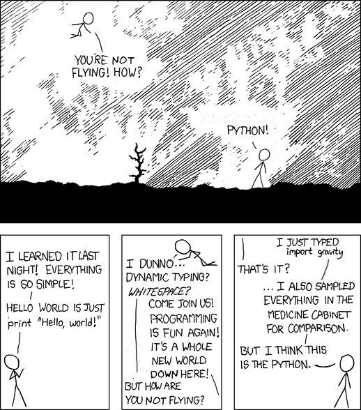

.. Water Stress Index API documentation master file, created by
   sphinx-quickstart on Sun May 22 15:07:26 2016.
   You can adapt this file completely to your liking, but it should at least
   contain the root `toctree` directive.

Water Stress Index API
=============================

Upstream API for an app that shows Global  Water Stress Index

.. toctree::
   :maxdepth: 2

Here's an Image
===============

Indices and tables
==================

* :ref:`genindex`
* :ref:`modindex`
* :ref:`search`
